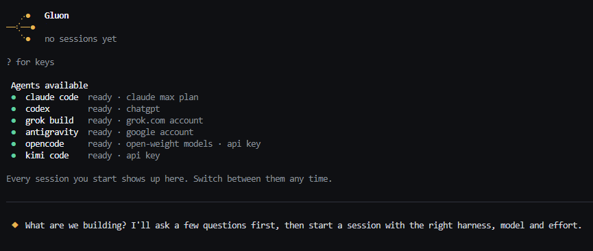

**Gluon** is a control platform for coding agents: run Claude Code, Codex, Antigravity, Grok Build, OpenCode and Kimi Code side by side in one terminal frame, on your own API keys or subscriptions.

Gluon enables two things:

1. **Choosing the most cost-effective agent for each session, within one harness or across several.** An agent is a harness × model × effort. Gluon works out a spec with you, then routes with configurable rules.
2. **Managing your agents' sessions**, with cost and context observability and analytics.

<p align="center"><a href="https://fidipro.github.io/gluon/concepts/manifesto/">Read our manifesto</a></p>

<p align="center">
  <a href="https://github.com/fidipro/gluon/actions/workflows/ci.yml"></a>
  <a href="https://github.com/fidipro/gluon/releases/latest"></a>
  
  
</p>

<p align="center"></p>

---

## Quickstart

### Install

> These install the [latest release](https://github.com/fidipro/gluon/releases/latest). To verify a download or install from a
> directory, see the [install guide](https://fidipro.github.io/gluon/getting-started/install/).

Linux, macOS, WSL:

```sh
curl -fsSL https://github.com/fidipro/gluon/releases/latest/download/install.sh | sh
```

Windows (PowerShell):

```powershell
irm https://github.com/fidipro/gluon/releases/latest/download/install.ps1 | iex
```

<details>
<summary>With Bun, or from source</summary>

Download the npm-style tarball `gluon-<version>.tgz` from the release, then `bun add -g ./gluon-<version>.tgz` (Linux, macOS). To build from a checkout, see [CONTRIBUTING.md](CONTRIBUTING.md).
Checksums, cosign and every installer option: [install guide](https://fidipro.github.io/gluon/getting-started/install/).

</details>

### Run `gluon` in your repo

```sh
cd your-repo && gluon
```

Describe what the session is for. The intake agent reads your repo, asks a few questions and proposes an agent, model and effort with a spec. Enter starts the session in the agent's own UI, inside Gluon's frame; go home with one key and start more. First run walks you through [connecting your agents](https://fidipro.github.io/gluon/getting-started/connect-agents/); the full tour is the [quickstart](https://fidipro.github.io/gluon/getting-started/quickstart/).

- **Agents:** Claude Code, Codex, Antigravity, Grok Build, OpenCode, Kimi Code; one guide each in the [harness guides](https://fidipro.github.io/gluon/guides/harnesses/claude-code/).
- **Platforms:** Linux, macOS, Windows; what is tested where is in [platforms](https://fidipro.github.io/gluon/concepts/platforms/).

## Docs

- [**Overview**](https://fidipro.github.io/gluon/)
- [**Getting started**](https://fidipro.github.io/gluon/getting-started/install/): [install](https://fidipro.github.io/gluon/getting-started/install/), [quickstart](https://fidipro.github.io/gluon/getting-started/quickstart/), [connect your agents](https://fidipro.github.io/gluon/getting-started/connect-agents/)
- [**Guides**](https://fidipro.github.io/gluon/guides/sessions/): sessions, routing, cost and context, analytics, security and privacy, troubleshooting
- [**Reference**](https://fidipro.github.io/gluon/reference/): CLI, config, `routing.yaml`, environment, models (generated)
- [**Concepts**](https://fidipro.github.io/gluon/concepts/architecture/): [architecture](https://fidipro.github.io/gluon/concepts/architecture/), [platforms](https://fidipro.github.io/gluon/concepts/platforms/), [manifesto](https://fidipro.github.io/gluon/concepts/manifesto/)
- [**Contributing**](CONTRIBUTING.md) · [**Security**](SECURITY.md) · [**Changelog**](CHANGELOG.md) · [**Support**](SUPPORT.md) · [**Code of conduct**](CODE_OF_CONDUCT.md)

`bun run docs:dev` serves the docs site locally.

## License

This repository is licensed under the [Apache-2.0 License](LICENSE). Contributions are welcome: see [CONTRIBUTING.md](CONTRIBUTING.md).

<!-- Keeping this file fresh:
Update when the install one-liners, the supported agents or platforms, the docs layout or the licence status change.
Keep it a landing page of at most 104 lines (test/readme.test.ts): detail lives in docs/, linked on the docs site; status only in
docs/concepts/platforms.md and docs/getting-started/install.md. The one-liners are checked by test/release.test.ts.
-->
